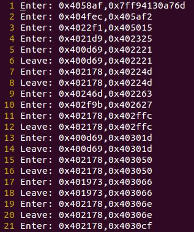
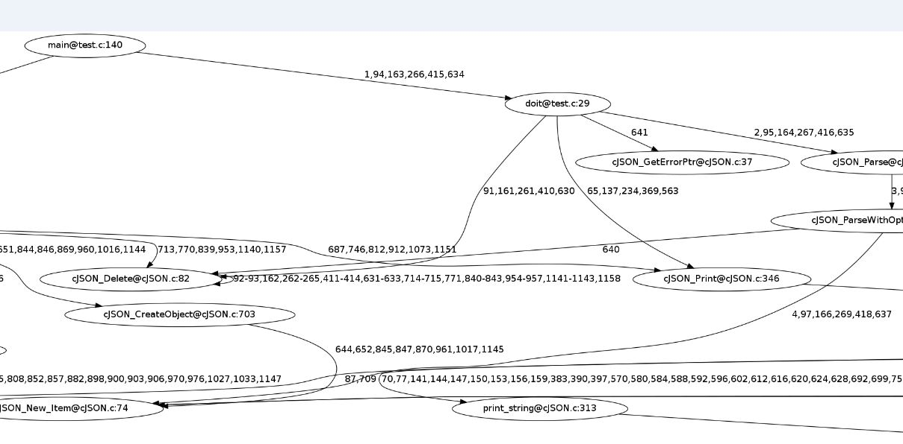
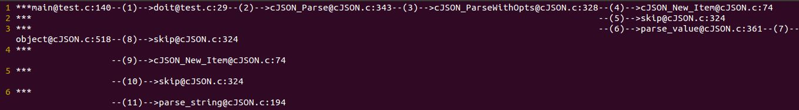

#gcc、g++程序函数调用关系生成器

##依赖

- pygraphviz

##USAGE

###实例（以cJson项目为例）

想查看test.c运行流程，自动生成运行函数调用图

###1.编译选项修改

在cJson项目的Makefile文件中，把：
>$(TESTS): cJSON.c cJSON.h test.c 
>$(CC) cJSON.c test.c -o test -lm -I.

修改为：
>$(TESTS): cJSON.c cJSON.h test.c 
>$(CC) -finstrument-functions -g cJSON.c test.c finstrument.c -o test -lm -I.

即添加-finstrument-functions和-g选项，链接文件finstrument.c

然后把finstrument.c文件放在makefile同一目录下

然后重新编译cJson项目，产生新的可执行程序test

###2.运行一下可执行文件，产生函数调用记录
>./test

生成了CallRecord.txt文件在同目录下

###3.生成调用图

>python buildCallGraph.py test

生成了调用图CallGraph.png和简笔图CallGraphAsSimpleFigure.txt

下图是调用图CallGraph.png：

下图是调用图CallGraph.png：

